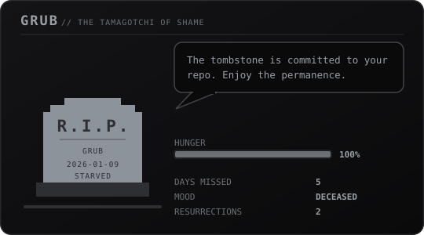

# 🪱 The Tamagotchi of Shame

**This creature dies if I stop coding.**

Meet **GRUB**. It lives in this repo, it watches my commit history, and it is not
supportive. At the end of every day in Kathmandu a GitHub Action checks whether I
committed anything. If I did, GRUB eats. If I didn't, GRUB starves — visibly, publicly, on
my profile — until it dies and leaves a tombstone with the date on it.

It can only be brought back by pushing a commit whose message is exactly
`i'm sorry`. The resurrection counter never resets.

<p align="center">
  <a href="../../issues/new?title=feed%20GRUB&body=here%20you%20go"></a>
</p>

<p align="center">
  <b><a href="../../issues/new?title=feed%20GRUB&body=here%20you%20go">🍓 Feed GRUB</a></b> —
  opens an issue titled <code>feed GRUB</code>. Submit it and he chews, sparkles,
  and puts <b>your username on the card</b> for 24 hours.
</p>

<!-- pet:caption -->
**hungry** · 1 day since the last commit · _Never died. Yet._
<!-- /pet:caption -->

> The line above is rewritten by the Action on every run. Don't edit it by hand;
> it will just overwrite you, which is thematically appropriate.

---

## Adopt one

<p align="center">
  <a href="https://github.com/masabinhok/grub/generate"></a>
</p>

<p align="center">
  <b><a href="https://github.com/masabinhok/grub/generate"> Use this template</a></b> ·
  <a href="../../fork"> Fork it</a> ·
  <a href="./docs/setup.md">Five-minute setup</a> ·
  <a href="./WALL-OF-SHAME.md">Wall of Shame</a>
</p>

**Use this template** gives you a clean repo with no commit history attached.
**Fork** keeps the link back here and shows up in the fork count. Either works —
the [setup](./docs/setup.md) is the same five minutes from both, and there is
nothing to install at either end.

The button above is one of the cards this thing generates, so it wears the
creature's current mood like everything else on the page. If GRUB is dead right
now, that button is grey. That is the honest advert.

---

## Documentation

| | |
| --- | --- |
| **[Setup](./docs/setup.md)** | Fork it for your own profile, Actions permissions, `PET_TOKEN`, private repos |
| **[Embedding the cards](./docs/embedding.md)** | Every card, copy-paste blocks, a full profile layout |
| **[Configuration](./docs/configuration.md)** | Every key in `grub.config.json`, your own snacks and insults |
| **[Feeding him](./docs/feeding.md)** | How anyone can feed GRUB, the safety rules, what `LURKERS` counts |
| **[Development](./docs/development.md)** | Repo layout, the local CLI, adding a card |
| **[Contributing](./CONTRIBUTING.md)** | Send a snack, a quote or an insult — good first PRs |
| **[Wall of Shame](./WALL-OF-SHAME.md)** | Every GRUB running in public, ranked by deaths survived |

Want it on your own profile? **[Start here](./docs/setup.md)** — about five
minutes, no build step, zero dependencies.

---

## How it works

| Days since last commit | State | What you see |
| --- | --- | --- |
| 0 | `thriving` | Bright greens, bouncing idle animation, unbearable smugness |
| 1–2 | `hungry` | Dimmer palette, slow drift, side-eye, passive aggression |
| 3–4 | `feral` | Colour draining out, twitching and tearing, visible ribs |
| 5+ | `deceased` | Tombstone, death date, **no animation at all** |

The stats — days since last commit, current mood, resurrection count — are
rendered *inside* the SVG, not in the caption. You can't fake them without
regenerating the image, and regenerating the image requires the real state file.

### All four states

The card at the top of this page only ever shows the state GRUB is actually in,
which on a good day is the least interesting one. Here is the rest of it — real
renders, animating, no cloning required. Watch the colour drain out.

<table>
  <tr>
    <td align="center"><b>thriving</b> — day 0<br><sub>bouncing, bright, unbearable</sub></td>
    <td align="center"><b>hungry</b> — day 2<br><sub>dimmer, slower, keeping notes</sub></td>
  </tr>
  <tr>
    <td></td>
    <td></td>
  </tr>
  <tr>
    <td align="center"><b>feral</b> — day 4<br><sub>tearing, twitching, ribs out</sub></td>
    <td align="center"><b>deceased</b> — day 5+<br><sub>a tombstone with a date on it</sub></td>
  </tr>
  <tr>
    <td></td>
    <td></td>
  </tr>
</table>

The tombstone is the whole point of the exercise: it carries the death date, it
does not move, and it gets committed to your repo and rendered on your profile
until you [apologise in public](#resurrection).

And this is what a stranger gets for [feeding him](./docs/feeding.md) — food
rains down, he chews, and **their** username is on the card for 24 hours:

<p align="center">
  
</p>

> These five are rendered off a pinned clock by `scripts/render_previews.js`, so
> they are stable, byte-identical between runs, and never quietly drift out of
> date with the real cards.

### Whose day is it

A day is a **calendar day in `timezone`** — `Asia/Kathmandu` out of the box — and
the Action runs at **23:30 local**, near the end of it. Those two facts belong
together: the job asks "was anything committed today?", so it has to ask while
today is still happening.

The upshot is the one you'd want. Commit at any point during a day and the count
stays at 0 when the day closes. Let a whole day go by untouched and it reads 1.
A commit at half past midnight counts for the day that just started — under a UTC
day boundary that same commit would have been filed five and three quarter hours
back, in yesterday, and the pet would have gone hungry over a commit that
happened.

Somewhere else in the world? Change `timezone` **and** the cron in
`.github/workflows/pet.yml` together; there is a worked example in the comment
above it. Only the creature's own clock moves — the traffic and contribution
numbers stay on GitHub's UTC days, because they are GitHub's to bucket.

### Resurrection

Once `alive` is `false`, the script skips all decay logic and just re-renders the
tombstone forever. The only way out:

```bash
git commit --allow-empty -m "i'm sorry"
git push
```

Case-insensitive. On the next run GRUB comes back with a burst of rotating light,
`resurrections` goes up by one, and that number stays in the image permanently.
That's the whole point — the shame is cumulative and public.

---

## The components

The pet is the centrepiece, but the same state file themes a whole set of cards.
Every one of them reads GRUB's mood, so when he starves the entire README
desaturates together — and when he dies, **nothing on the page animates at all.**

| File | Size | What it shows |
| --- | --- | --- |
| `assets/banner.svg` | 840×120 | Name, location, mood-reactive status pips |
| `assets/marquee.svg` | 840×88 | CRT ticker — a new joke, quote or fact every day |
| `assets/divider.svg` | 840×12 | Dashed rule that drifts while alive, freezes when dead |
| `assets/pet.svg` | 540×300 | GRUB himself, asking to be fed |
| `assets/streak.svg` | 420×180 | A fire the size of your streak, one coal per day |
| `assets/eye.svg` | 420×180 | An eye that watches back. Lurkers vs. people who fed him |
| `assets/star.svg` | 420×180 | One glazed star holding every star you've earned |
| `assets/stats.svg` | 420×180 | Repos, stars, followers, contributions |
| `assets/languages.svg` | 420×180 | Top languages as a segmented bar |
| `assets/inventory.svg` | 420×196 | Tech stack as an RPG equipment screen |
| `assets/cta.svg` | 840×64 | The adoption button at the top of this page |

Copy-paste blocks for all eleven, plus a finished profile layout, are in
**[Embedding the cards](./docs/embedding.md)**. Turn any of them off with
`components` in [`grub.config.json`](./grub.config.json).

---

## Feeding him

**Anyone can feed GRUB.** [Open an issue](../../issues/new?title=feed%20GRUB)
whose title starts with `feed` or `pet` and he chews, sparkles, and wears **your
username on the card** for 24 hours. Nothing to install.

What he gets is picked from a pantry — a berry, a donut, a coffee, a cold slice,
a cookie, or a bug — and the reply tells you which, because the card is genuinely
raining that one. [Adding another](./CONTRIBUTING.md#add-a-snack) is a small
self-contained PR: some pixel art and one rude line.

It is also, deliberately, cosmetic. A snack never touches `hunger`, `mood` or
`alive` — only commits keep GRUB alive, and only `i'm sorry` revives him. That
gap between people who looked and people who acted is the whole `LURKERS` vs
`FED` split on the eye card.

The full rules, the abuse limits on a public write path, and an honest account of
what `LURKERS` actually measures: **[Feeding him](./docs/feeding.md)**.

---

## GRUBs in the Wild

Every GRUB running in public, ranked by **deaths survived** — the counter that
never resets. A high rank is not an achievement. It means that many commits in
your history read `i'm sorry`.

<p align="center">
  <b><a href="./WALL-OF-SHAME.md">🪦 See the Wall of Shame →</a></b>
</p>

**Getting on it takes one PR.** Adopt a GRUB, then add yourself to
[`wall-of-shame.json`](./wall-of-shame.json):

```json
{
  "user": "your-github-login",
  "repo": "the-repo-your-grub-lives-in",
  "petName": "WHATEVER YOU RENAMED IT TO",
  "note": "one dry line, 60 characters"
}
```

That is the whole submission. The table rebuilds itself on the next daily run:
`scripts/render_wall.js` reads each fork's `pet-state.json` — a public file in
every one of these repos — and re-ranks the wall. No form, no service, no
account beyond the GitHub one you have. Full field reference and the house rules
are on [the wall itself](./WALL-OF-SHAME.md#get-on-the-wall).

---

## Under the hood

```
scripts/update_pet.js          # entrypoint: CLI, state machine, writing files
scripts/feed_grub.js           # the feed counter, and nothing else
scripts/render_previews.js     # the four-state showcase, off a pinned clock
scripts/render_wall.js         # the Wall of Shame, off every fork's public state
scripts/lib/                   # state, github, palette, svg, glyphs, snacks, copy...
scripts/generators/            # one module per card + index.js registry
grub.config.json               # your settings. never written by the bot
pet-state.json                 # the only persistence layer. no database
wall-of-shame.json             # the fork list. one PR per entry
assets/*.svg                   # generated output, committed by CI
docs/previews/*.svg            # the showcase renders, regenerated on demand
.github/workflows/             # the daily cron, and feeding by anyone who asks
```

No backend, no database, no third-party services. Just the GitHub API and one
file of state committed to the repo. **Zero dependencies** — no `package.json`, so
no `npm install` step in CI and the whole job runs in about fifteen seconds.

Local commands and how to add a card: **[Development](./docs/development.md)**.

---

## Caveats

- By default **private commits don't count** — see [Feeding it on private
  repos](./docs/setup.md#feeding-it-on-private-repos), which is a genuine trade
  rather than a switch you just flip.
- GitHub proxies README images through its `camo` cache, so a freshly updated
  pet can lag by a few minutes before it shows up on your profile.
- The Action's own commits are filtered out by author and by `[skip ci]`, so the
  pet can never feed itself.
- The eye's `LURKERS` figure starts at zero on the day you first run it and
  counts repo traffic. It is not a profile README view counter, because no such
  thing is possible for anyone.
- Feeding him is cosmetic on purpose. If you were hoping the button would keep
  him alive, that is the joke.

---

*GRUB has no feelings. GRUB has a commit log. These are not the same thing, but
GRUB does not care about the distinction.*
